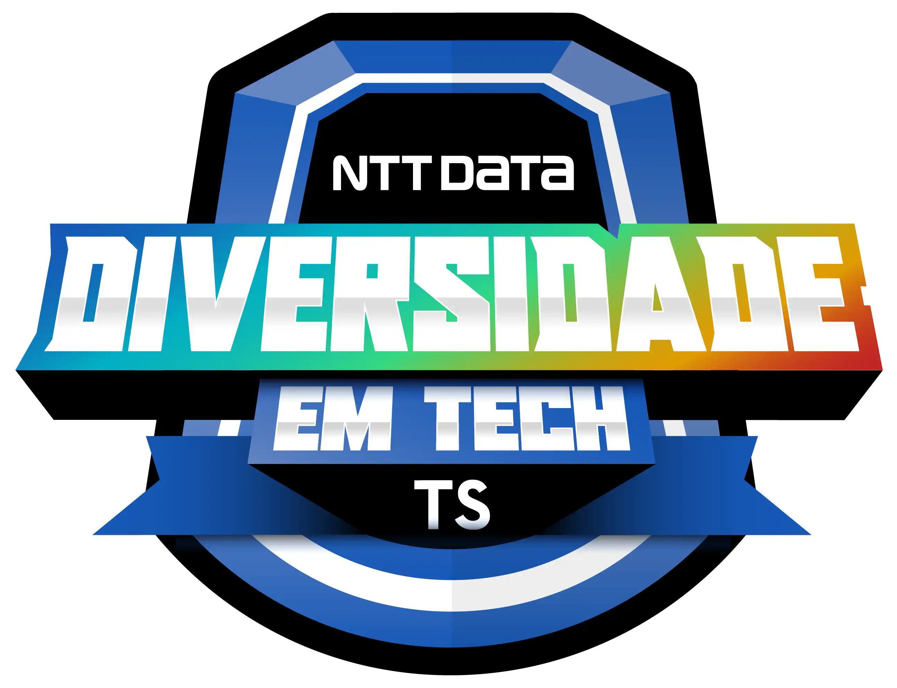

<h1 align="center">
  NTT DATA Diversidade em Tech
</h1>

<h2 align="center">
  
</h2>

  <a href="#-projeto">🖥️ Projeto</a>&nbsp;&nbsp;&nbsp;|&nbsp;&nbsp;&nbsp;
  <a href="#-tecnologias">🚀 Tecnologias</a>&nbsp;&nbsp;&nbsp;|&nbsp;&nbsp;&nbsp;
  <a href="#-license">📝 License</a>

## 💻 Projeto

Repositório criado para os desafios de códigos do bootcamp NTT DATA Diversidade em Tech da DIO.

## 🚀 Tecnologias

- JavaScript

## 📝 License

Esse projeto está sob a licença MIT. Veja o arquivo [LICENSE](LICENSE) para mais detalhes.

---

## 📚 Lista dos Desafios

### Dominando Algoritmos Básicos com Desafios de Códigos JavaScript

- Somando Múltiplos [ver aqui](./DesafioBasico1/main.js)
- Triângulo de Moedas [ver aqui]()
- Soma de Pares Consecutivos [ver aqui]()
- Calculando o Perímetro de um Triângulo Equilátero [ver aqui]()
- Subtraindo o Produto e a Soma de um Número [ver aqui]()

### Dominando Algoritmos Intermediários com Desafios de Códigos JavaScript

- Porcentagem de diferença entre dois números [ver aqui]()
- Fatorial desajeitado [ver aqui](./DesafioIntermediario2/main.js)
- Numeral romano [ver aqui]()
- Duplicando zeros [ver aqui]()
- Removendo letras duplicadas [ver aqui]()
